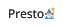

<p align="center">
  
</p>

[circleci-image]: https://img.shields.io/circleci/build/github/nestjs/nest/master?token=abc123def456
[circleci-url]: https://circleci.com/gh/nestjs/nest

  <p align="center">Reviews de produtos <strong>reais</strong> feito por <strong>pessoas reais:star2:<strong></strong></p>
    
  <!--[](https://opencollective.com/nest#backer)
  [](https://opencollective.com/nest#sponsor)-->

<h2>Description</h2>

<p style="font-weight: lighter">Criei esse projeto com o objetivo de ir aprendendo NestJS de forma autodidata junto com o Prisma e colocando em prática os conhecimentos adquiridos, posteriormente também pretendo fazer um client com Angular e integrar as funcionalidades, por enquanto sem previsão.</p>

<p style="font-weight: lighter">A idéia inicial do aplicativo é ser uma central de Reviews sobre os mais variados tipos de produtos, é extremamente comum, principalmente em compras pela internet buscarmos informações sobre o produto através de Reviews e na maioria das vezes é sempre no YouTube, no entanto, isso nos leva a um problema que são as chamadas Reviews "Patrocinadas" onde a pessoa que está fazendo a review tem uma opinião enviesada por ter sido pago para falar bem. </p>

<p style="font-weight: lighter">Na plataforma a idéia e incentivar as pessoas "comuns" a escreverem suas avaliações de forma "não-profissional" e ajudar outras pessoas na tomada de decisão.

## Installation

```bash
$ npm install
```

## Running the app

```bash
# development
$ npm run start

# watch mode
$ npm run start:dev

# production mode
$ npm run start:prod
```

## Test

```bash
# unit tests
$ npm run test

# e2e tests
$ npm run test:e2e

# test coverage
$ npm run test:cov
```
